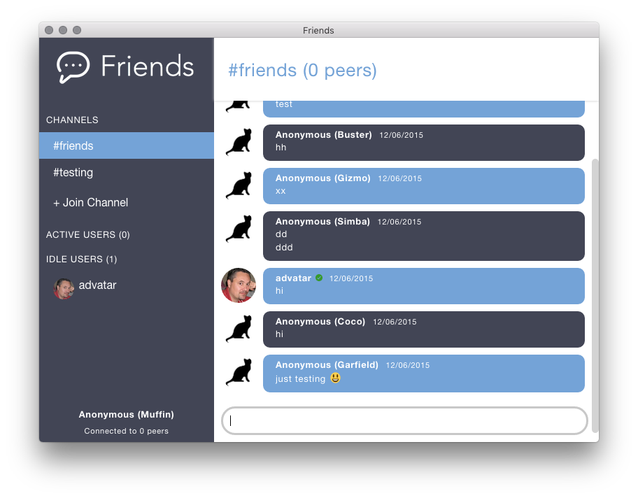

# Friends

[![travis][travis-image]][travis-url]
[![david][david-image]][david-url]

[travis-image]: https://img.shields.io/travis/moose-team/friends.svg?style=flat-square
[travis-url]: https://travis-ci.org/moose-team/friends
[david-image]: https://img.shields.io/david/moose-team/friends.svg?style=flat-square
[david-url]: https://david-dm.org/moose-team/friends


### P2P chat powered by the Web



**Alpha quality** you probably only want to use this if you like to send pull requests
fixing things :)

## How it works

See [our site](http://moose-team.github.io/friends/) or the `gh-pages` branch.

## Logging in

You need a working git + github configuration

- have a publicly listed github email (e.g. shows up on your github account)
- if you dont wanna do that then do `git config --global user.username yourusername`

When you launch the app it should "just work" now if you have git setup correctly :)

If it doesnt work, do this to get debug information:

```
$ npm i github-current-user -g
$ DEBUG=* github-current-user
```

Note: DSA keys are not supported. You should switch to RSA anyway for security reasons.

If it can't verify you, try doing `ssh-add ~/.ssh/id_rsa`. Your key should show up when you run `ssh-add -l`.

## Building

You'll need the newest io.js and npm (`>= 1.8.1`, `>= 2.8.3`)

* `npm install`
* `npm run rebuild-leveldb` to compile leveldown for [electron](http://electron.atom.io/). you will have to modify the command in package.json if you are not on a 64-bit architecture
* `npm start` to run in electron
* `npm run package` to build distributable.

## Contributing

Contributions welcome! Please read the [contributing guidelines](CONTRIBUTING.md) before getting started.

## License

[MIT](LICENSE.md)
